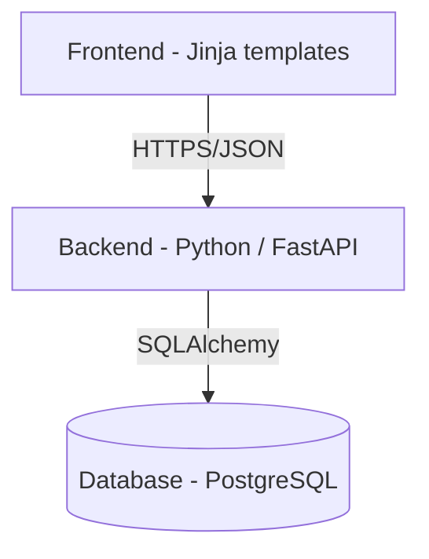
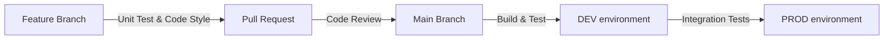

# Design Doc

This document contains the technical plan for the implementation of LolTracker.

## System Architecture Overview

The following diagram depicts the layout of the project components and core technologies:



* **Frontend** (Jinja templates):
   * Enhanced with CSS and JavaScript
   * `MainPage`: Displays search bar users can use.
   * `SummonerPage`: View for a specific Summoner account, including calculated statistics and match history.
   * `MatchDetail`: Expanded information about  specific match.
   * `ChampionPage`: View for a specific Champion, including calculated statistics for different game modes and game versions.
* **Backend** (Python / FastAPI):
   * `DAO` (Database Access Object): Logic for the necessary CRUD-style operations with the database using SQLAlchemy.
   * `Summoner Service`: Logic for retrieving Summoner data and match history from database and calculating statistics.
   * `Champion Service`: Logic for retrieving Champion data from database and calculating statistics.
   * `Riot API Handler`: Logic for interacting with external Riot API to recieve recent match data for individual Summoners.
* **Database** (PostgreSQL)
* **Infrastructure**
   * Monitoring: Storage for monitoring data and logs.
   * Testing: pytest for unit and integration tests.
   * Deployment: Azure Cloud, GitHub Actions (CI/CD)
   * Local development: Docker

## Data Model

### Entity Relationships



The **Favorite_champions** field of **Summoner** is an array of **ChampionPlayerStats** sorted by **games_played** from highest to lowest.

### Database Migrations

Schema changes are managed with **Alembic** (the standard migration tool for SQLModel/SQLAlchemy).

| Command | Purpose |
|---|---|
| `alembic upgrade head` | Apply all pending migrations |
| `alembic downgrade -1` | Roll back the last migration |

* Migration files live in `alembic/versions/`.
* Every migration **must** include a working `downgrade()` function.

### Database Schema

The database uses triggers to automatically update statistics in **Champion_Stats** and **Summoner** whenever a **Match_Participant** is added. Likewise the **count** field of **Matches_Analyzed** gets incremented when a new **Match** is added to the database.



## Technologies

### Technological Dependencies

- Python 3.x
- FastAPI
- PostgreSQL
- HTTP client for communication with Riot API
- Docker

### External Dependencies

The system is dependent on the availability and functionality of the Riot Games API service. In the event where this service is unavailable, it will be impossible to update the database with new data (old data will still be available and displayed).

### API Limits

The Riot Games API limits how many requests can be sent to it within a specific period of time. As a result, the backend must implement a mechanism for limiting the flow of requests to it (rate limiting).

## API & Interface Specification

The backend application provides server-side generated HTML pages. The client (internet browser) communicates with the server via HTTP requests. User authentication is not needed for the use of any endpoints.

### Main Endpoints

| Method | Path | Description |
| ------ | --------------------- | ---------------------------- |
| `GET` | `/` | Main page of the application |
| `POST` | `/` | Searches for the given Summoner or Champion |

```json
// GET /
// 200 → Main page Jinja template
// Note: should always return 200 as it has no request body

// POST / — request body
{ "summoner_name": "ProGamer", "summoner_tagline": "1337", "champion_name": "" }
// 303 → Summoner page Jinja template if Summoner was found or Summoner not found Jinja template
// Note: the same logic applies to champion search, only one type of search is possible at a time
```

### Summoner Endpoints

| Method | Path | Description |
| ------ | --------------------- | ---------------------------- |
| `GET` | `/summoner/{name}/{tagline}` | Page with the specified Summoner's stats |
| `GET` | `/summoner/not-found` | Page displaying that the given Summoner couldn't be found |

```json
// GET /summoner/{name}/{tagline} - request body
{ "name": "ProGamer", "tagline": "1337", "offset": 0, "ajax": False}
// 200 →  Summoner page Jinja template · 303 → redirect to Summoner not found page
// Note: offset and ajax are used for match history pagination

// GET /summoner/not-found
// 200 → Summoner not found page Jinja template
```

### Champion Endpoints

| Method | Path | Description |
| ------ | --------------------- | ---------------------------- |
| `GET` | `/champion/{name}` | Page with the specified Champion's stats |
| `GET` | `/champion/not-found` | Page displaying that the given Champion couldn't be found |

```json
// GET /champion/{name} - request body
{ "name": "Ahri", "version": "14.5", "ajax": False}
// 200 →  Champion page Jinja template · 303 → redirect to Champion not found page
// Note: ajax here is used to avoid reloading the entire page when users change version

// GET /champion/not-found
// 200 → Champion not found page Jinja template
```

## Infrastructure & Deployment

>TODO: update once we start deployment

Current plan is to host the application using Azure. This will require setting up the Azure Cloud environment as well as creating a CI/CD pipeline.

High-level plan:



## Reliability & Observbility

>TODO: populate this segment once we establish monitoring, see https://github.com/ljezek/tul-psi/blob/main/docs/DESIGN.md#reliability--observability

## Testing Strategy

### Unit Tests

**Backend** - pytest possibly with `pytest-cov`:

* Tests cover the service layer and API route handlers; the persistence layer is replaced with in-memory fakes.
* Coverage target: **≥ 80 %** line coverage, enforced in CI with `--cov-fail-under=80`.
* Run locally: `pytest --cov=app --cov-report=term-missing`

### Integration Tests

>TODO: populate once we establish integartion tests

### CI/CD Quality Gates

| Stage | Checks |
|---|---|
| PR (every push) | `pytest` with coverage gate (currently run locally) |
| Merge to `develop` | All PR checks + code review |
| Deploy to `main` | _(Azure — milestone 3)_ |