# Product Specification: LolTracker

## Product Vision & Target Audience

**LolTracker** is a platform designed as a project for the community around the videogame League of Legends (_LoL_). It aims to provide a centralized system to search up statistics for players (Summoners) and playable characters (Champions) for multiple game versions and game modes. These statistics are calculated using data recieved from Riot API.

**Target Audience:**
*   **LoL players:** To search up their own accounts and monitor their in-game performance across a period of time.
*   **Coaches:** To quickly analyze the performance of players that seek them out for help with improving at the game.
*   **Riot Balance Team:** To see how changes to Champions affect how often they are played or banned in various game modes.

**Success metrics:**
*   Passing the PSI course at the Technical University of Liberec (_TUL_).

## User Scenarios

### 1. User searches for a Summoner profile
A user visits the site with the intention to look up a specific Summoner profile. They use the Summoner search bar on the main page which redirects them to a new page displaying the Summoner's profile. Here they see the Summoner's win rate ratio, KDA (_Kills, Deaths and Assists_) and recently played matches.

### 2. User displays more matches for a Summoner
A user on a specific Summoner's page decides to take a look at more matches than the initial profile load showed. To do this, they press the "Load More" button, which displays more matches without reloading the page. This can be repeated until there are no remaining matches to be shown at which point the button is removed.

### 3. User inspects a specific match
While viewing a Summoner's profile using LolTracker, the user becomes more curious about a certain match and wishes to see more detailed information. To do this, they click on the match which results in further statistics from the match being shown in a drop-down expansion.

### 4. User searches for a specific Champion
A user wishes to see information about a specific Champion. To access this Champion's statistics they use the Champion search bar to be redirected to the Champion's page. This page contains globally calculated statistics such as pick rate, win rate and ban rate. The user can switch which game mode and which game version these statistics are shown for independently.

## UX Flow

The application will not require users to register or log in to access any of its features.

## Prototype

Working prototype of this apllication can be found in [the prototype folder](../prototype/). Follow the instructions there to run the prototype locally.

## Functional Requirements

### Must Have
*   **Search functionality:** Ability for users to search for individual Summoners and Champions.
*   **Summoner statistics:** A page where Summoner statistics will be shown for the searched Summoner.
*   **Match history:** Show recently played matches for individual Summoners and allow the user to look further into the Summoner's match history
*   **Match details:** Allow more detailed information about individual matches to be displayed at will by expanding the given match.
*   **Champion statistics:** A page where global Champion statistics will be shown for the searched Champion
*   **Filtering:** Allow the user to filter Summoner matches by game mode and filter Champion statistics by version and game mode.

### Should Have
*   **Favorite Champions:** Show the most played Champion for each Summoner as part of their main overview.
*   **Champion Kits:** Allow users to see what each Champion's abilities do on the Champion statistics page.
*   **Item Descriptions:** Display information about individual items bought by Summoners during matches by hovering over them or clicking on them.
*   **Web and Mobile:** The app should work on both web and mobile clients.

### Could Have
*   **Ranked Division:** Display a Summoner's division in Ranked game modes.
*   **Multiple Visual Themes:** Switching between Light and Dark color themes.
*   **Item Page:** Page displaying all items available in League of Legends along with what they do, but without global usage statistics.

### Won't Have

The following is Out of Scope for this project:
*   **Login & Registration:** All of the features of the application will be available without needing to authenticate the user.
*   **Build Creation:** No tools allowing players to create and submit builds for individual or groups of Champions.
*   **Leaderboards:** The application will allow users to search for individual Summoners, but not for the best Summoners worldwide.
*   **Esports Information:** There will not be any news about professional League of Legends play within this application. This includes match schedules, tournament standings or team compositions.

## Non-Functional Requirements

*   **Riot API Communication:** The app must be able to communicate with the official Riot API to retrieve data about individual matches.
    * **Rate limiting** for Riot API calls has to be implemented to ensure we can comfortably stay within the limit imposed on us. Similarily, **burst calls** should be implemented to utilize all available API calls before their amount is refreshed.
*   **Availability & Reliability:** The application must be hosted online (preferrably on Azure) with a target availability of 99%.
    * **Health checks** should be implemented to allow for automated instance recovery once hosted online.
*   **Observability:** Real-time monitoring and logging must be configured using available tools.
*   **CI/CD Pipeline:** An automated CI/CD pipeline must be established, executing tests on every commit to the `main` and `develop` branches. Furthermore, successful builds in `main` must be automatically deployed to our hosting service provider.
*   **Code Quality & Maintainability:** The project must adhere to "Clean Code" principles.
    *   All architectural decisions and changes must be **documented** in the repository via Markdown files (README, Spec, and Design Doc).
    *   All code must have consistent **code style**.
    *   No direct commits to the `main` (all changes are made via **Pull Requests with Code Review**).
    *   **Unit tests** with > 80% coverage.