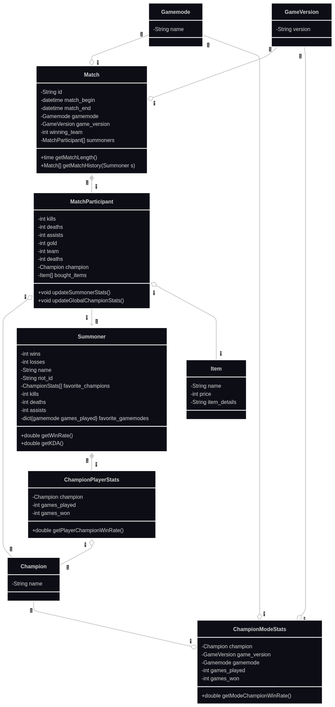
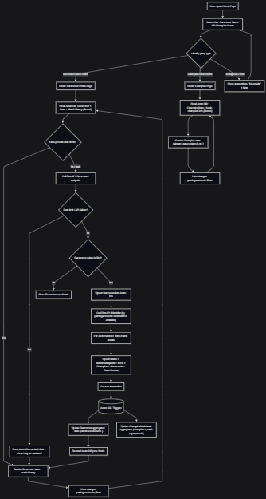
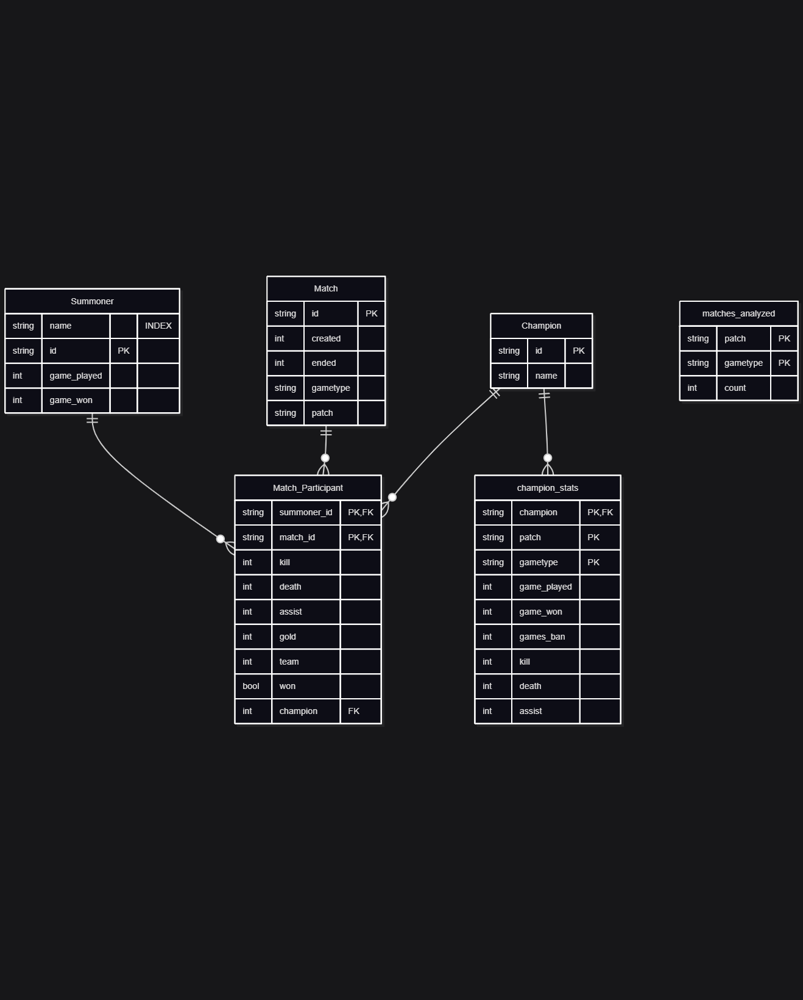
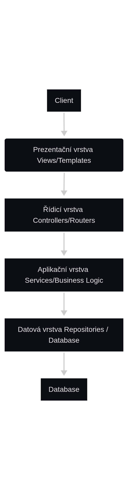

# LolTracker
## 1 Popis systému

Systém zobrazuje data hráčů League of Legends a jejich historii zápasů. Data stahuje z Riot API a ukládá si je do databáze.

Systém:

- komunikuje s oficiálním rozhraním Riot Games API
- získává data o hráčích a jejich historii zápasů a ukládá je do databáze
- načítá a zobrazuje data ze své databáze
- vyhledání hráče podle jména
- zobrazení historie zápasů konkrétního hráče
- zobrazení statistik pro jednotlivé postavy

## 2 Diagram tříd

## 3 Závislosti systému 

### 3.1 Technologické závislosti

- Python 3.x
- FastAPI
- Databázový systém (bude upřesněn)
- HTTP klient pro komunikaci s Riot API

### 3.2 Externí závislosti

Systém je závislý na dostupnosti a funkčnosti služby Riot Games API.
V případě nedostupnosti externí služby nebude možné aktualizovat data hráčů.

### 3.3 Omezení API

Riot API omezuje počet požadavků za časovou jednotku. Backend musí implementovat mechanismus řízení počtu požadavků (rate limiting).

## 4 Specifikace webového rozhraní

Backendová aplikace poskytuje server-side generované HTML stránky. Klient (webový prohlížeč) komunikuje se serverem prostřednictvím HTTP požadavků a server vrací plně vykreslený HTML dokument.

### 4.1 Přehled webových endpointů

| Metoda | URL                   | Popis                        |
| ------ | --------------------- | ---------------------------- |
| GET    | /                     | Úvodní stránka aplikace      |
| GET    | /player/{name}       | Statistiky hráče a jeho historie|
| GET    | /champion/{name}      | Statistika postavy |
| GET   | /match/{id}           | Detailní informace o zápase   |

#### 4.1.1 GET/

- domovská stránka
- obsahuje vyhledávání (lze vyhledávat hráče i postavu)

#### 4.1.2 GET/player

- obsahuje počet nahraných her a winrate
- obsahuje historii zápasů
- obsahuje vyhledávání (lze vyhledávat hráče i postavu)
- při rozkliknutí zápasu přesuna na match/{id}

#### 4.1.3 GET/champion

- obsahuje počet nahraných her a winrate podle patche a ranku
- obsahuje vyhledávání (lze vyhledávat hráče i postavu)

#### 4.1.4 GET/match

- obsahuje všechny účastníky zápasu a jejich score
- obsahuje čas začátku a konce zápasu

### 4.2 Architektonický model

- aplikace odpovídá modelu MVC:
- model – databázové entity (hráč, zápas)
- view – HTML šablony
- controller – router, endpointy FastAPI

## 5 Flowchart

## 6 Databáze

Při přidání do tabulky Match_Participant se automaticky upraví hodnoty v tabulkách champion_stats a summoner.

## 7 Riot API

Stažená data se ukládají do databáze. Systém má seznam hráčů, pro které průběžně stahuje nová data. Pokud uživatel vyhledá hráče, který není v databázi, aplikaci stáhne menší množství dat a zobrazí je uživateli, pokud to je možné.

Aplikace si sama kontroluje limit požadavků.

### 10 Architektura backendu

todo todo todo

####  Prezentační vrstva

- Obsahuje HTML šablony (např. Jinja2)
- Generuje stránky, které se zobrazují uživateli
- Nemá žádnou business logiku
- Pouze zobrazuje data, která jí poskytuje aplikační vrstva

#### 10.3 Řídicí vrstva (Controllers / Routers)

- Obsahuje endpointy FastAPI
- Zpracovává HTTP požadavky
- Volá aplikační vrstvu (Services)
- Předává data prezentační vrstvě
- Řeší validaci vstupů z formulářů

@router.get("/players/{id}")
async def player_detail(id: int, service: PlayerService = Depends()):
    player = await service.get_player(id)
    return templates.TemplateResponse("player_detail.html", {"player": player})

#### 10.4 Aplikační vrstva (Services / Business Logic)

- Obsahuje veškerou business logiku systému
- Řeší procesy, pravidla a transformace dat
- Komunikuje s datovou vrstvou (Repository)
- Asynchronně volá Riot API, pokud data nejsou v cache

#### 10.5 Datová vrstva (Repositories / Database)

- komunikuje s databází
- abstrakce nad databází

#### 10.6 Komunikace mezi vrstvami

1. Uživatelský požadavek → Controller
2. Controller volá Service
3. Service volá Repository (DB)
4. Pokud data nejsou v DB, Service volá Riot API → uloží do DB
5. Controller vrací data prezentační vrstvě (HTML stránku)